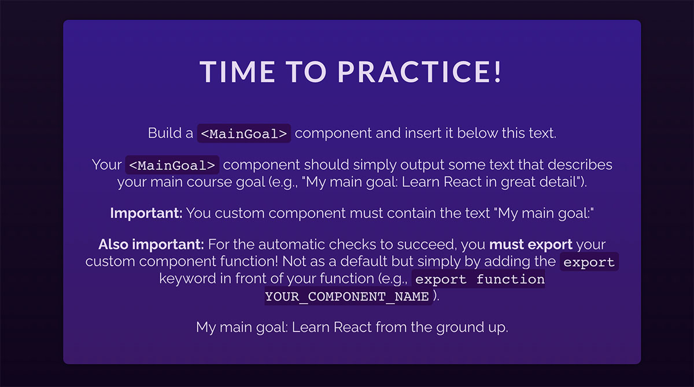

## Exercise: Building & Using a Component

Your task is to create a new <code>MainGoal</code> component which outputs a paragraph of text that describes your main course goal (e.g., <i>"My main goal: Learn React in-depth and from the ground up")</i>.

You'll have to create this new component from scratch and then use it inside the <code>App</code> component's JSX code.

The finished app could like like this:

<i>(notice the "My main goal: Learn react from the ground up" text at the bottom)</i>

<b>Important:</b> To ensure that the automatic checks correctly detect your solution, your component <b>must be called</b> <code>MainGoal</code> and it also <b>must be exported</b>. To do that, simply add the export keyword in front of your <code>MainGoal</code> component.

The <code>MainGoal</code> component <b>must also contain the text</b> <i>"My man goal:"</i> (followed by whatever your main course goal is).